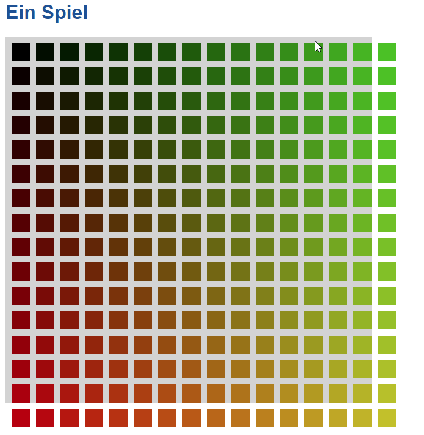

# Notes

## JavaScript Beispiele 

```javascript
if (1 > 2) {
    lively.notify("hello");
} else {
      lively.notify("world");
}
```


## Programmieren für Nepomuk


```javascript


var a = 3; // variable a; 3 ist eine number

var b =  a + 1

a = a + 1

var person1 = {name: "Nepomuk", born: 2007} // Objekte

var person2 = {name: "Jens", born: 1981}

// var person = o

function ageByYear(person) {
  var today = new Date()
  var thisYear = today.getFullYear()
  var age = thisYear - person.born 
  return age
}

ageByYear(person1) 

var executionCounter = 0

function whoIsOlder(person1, person2) {
  executionCounter = executionCounter + 1
  lively.notify("Wer ist älter wird berechnet: " + executionCounter)
  if (ageByYear(person1) >= ageByYear(person2)) {
    return person1 // return first person if same age
  } else {
    return person2
  }
}

var oldPerson ={name: "Metusalem", born: -2000}

whoIsOlder(person1, person2)
whoIsOlder(person1, oldPerson)


var liste = [person1, person2, {name: "Olli", born: 2001}]

function averageAgeOfTwoPersons(person1, person2) {
  return (ageByYear(person1) + ageByYear(person2)) / 2
}

averageAgeOfTwoPersons(person1, person2)

// var listOfPersons = liste

function averageAge(listOfPersons) {
  var totalAge = 0
  for(var person of listOfPersons) {
    var age = ageByYear(person)
    totalAge = totalAge + age
    lively.notify(person.name + " " + person.born + " " + age)
  }
  return totalAge / listOfPersons.length
}

averageAge(liste)


```


```javascript 
var birth_day=3
var birth_month=4
var birth_year=2000
var today_day=18
var today_month=1
var today_year=2022

var age_day = today_day-birth_day
if age_day < 0 
  var birth_month+1

var age_month = today_month-birth_month
if age_month < 0
  var birth_year+1 

var age_year = today_year-birth_year

return age_year 

```

<table>
  <thead>
    <tr>
      <th>Nepomuk</th>
      <th>Reich</th>
    </tr>
  </thead>
  <tbody>
    <tr>
      <td>Name</td>
      <td>Vorname</td>
    </tr>
  </tbody>
 </table>

<table>
  <thead>
    <tr>
      <th>Vorname</th>
      <th>Name</th>
    </tr>
  </thead>
  <tbody>
    <tr>
      <td>Donald</td>
      <td>Duck</td>
    </tr>
  </tbody>
</table>


```javascript
let born_day = 7 ;
let born_month = 6 ;
let born_year = 2007 ;
let today_day = 19 ;
let today_month = 1 ;
let today_year = 2022 ;
born_day=born_day+1 
```


 # Code der komisch aussieht
 
```javascript

function daysInMonth(month) {
  //lively.notify(month)
  if (month)== 1)
    return 31
  if (month == 2)
    return 28
  if (month == 3)
    return 31 
  if (month == 4)
    return 30
  if (month == 5)
    return 31
  if (month == 6)
    return 30
  if (month == 7)
    return 31 
  if (month == 8)
    return 31
  if (month == 9)
    return 30
  if (month == 10)
    return 31
  if (month == 11)
    return 30
  if (month == 12)
    return 31
} 

```

Und das sieht besser aus:
 
 ```javascript

function daysInMonth(month) {
  // leap years are ignored (for now)
  var days = [31,28,31,30,31,30,31,31,30,31,30,31]
  return days[month-1]
} 


```


## Ein Spiel



 


## More JavaScript


```javascript

var a = 0
var s = ""

// iterate with a loop
for(var i=0; i<7; i++) {
  s += " " + i
  a += i
}

a = "Hallo"

var c = [1,2,3]

var b = {f: 3}

var d = function() { }


function f(x, y) {
  return x * y
}

// recursion
function f(x) {
  if (x == 0) {
    return 0
  }
  return x + f(x - 1)
}


f(0)
f(1)
f(2) 
f(3)
f(4)


```


